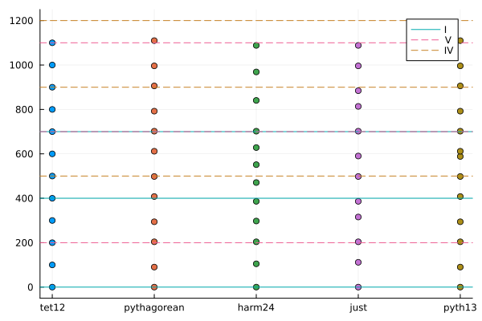
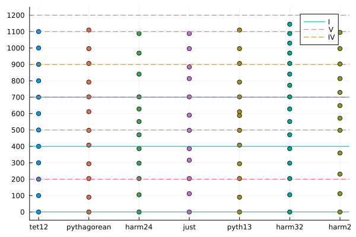
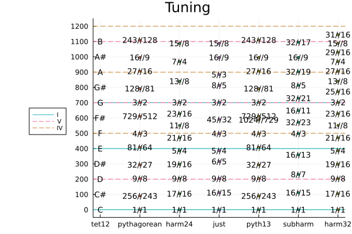
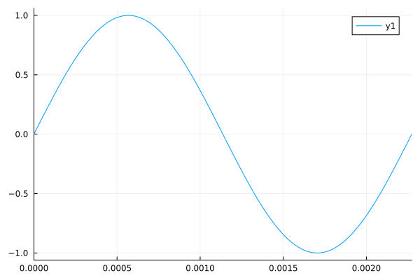
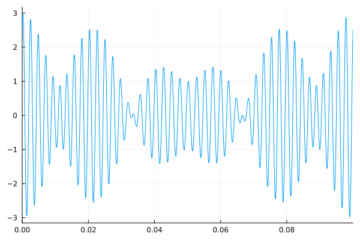
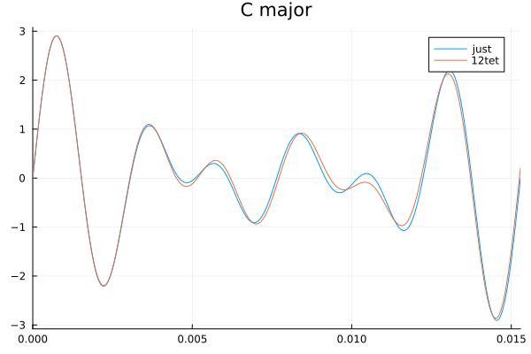

```@meta
CurrentModule = TuningSystems
```

# TuningSystems

Documentation for [TuningSystems](https://github.com/tp2750/TuningSystems.jl).

# Tunings

``` julia
using TuningSystems
using Plots
plot(tet12, markersize=0)
plot!(pythagorean)
plot!(harmonics(24))
plot!(just)
plot!(pythagorean13)
hline!([0,400,700], label="I")
hline!([700, 1100, 200], label="V", line=(1,:dash))
hline!([500, 900, 1200], label="IV", line=(1,:dash))
plot!(subharmonics(24))
plot!(harmonics(32))
```







The number of the harmonics is the nominator of the fraction.
The number of the sub-harmonics is the denominator of the fraction

# Playing

Define Tone and Sound structs using frequencies.

``` julia
using TuningSystems
using Plots
plot(sound(tone(400)), xlim=(0,1/400))
```



Tones in a row matrix are played together.
`s` is shourhand for `sound`, and there is an implicit `tone` when just giving the frequency.

``` julia
plot(s([s(400) s(440) s(450)]), xlim=(0,1/10), label="")
```




Actually play it

``` julia
using TuningSystems
play(s(440))
```

# Playing in Tune

n: Note, t: Tone, s: Sound.

``` julia
play(s(t.(n.(split("C E G")),tuning=tet12)), bpm=30)
play(s(t.(n.(split("C E G")),tuning=just)), bpm=30)
```

``` julia
plot(s(t.(n.(split("C E G")),tuning=just)), xlim=(0,1/65.4), label="just", title="C major")
plot!(s(t.(n.(split("C E G")),tuning=tet12)), xlim=(0,1/65.4), label="12tet")

```



Shorthand

tns = tone.(note.(split()))

``` julia
play(s.(tns("C E G",tuning=just)), bpm=60)
play(s(tns("C E G",tuning=just)), bpm=20)

```

```@index
```

```@autodocs
Modules = [TuningSystems]
```
# Workshop!

## TuningSystems.jl

```@docs
TuningSystems
```

See the [Tutorial](@ref tutorial)
for how to use this package.

