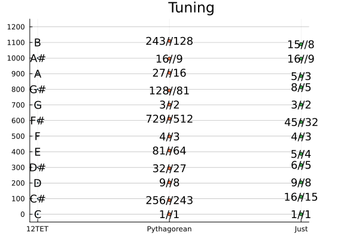

# TuningSystems

Using https://sli.dev/guide/syntax

# The equal tempered tuning

 Frequency ration between each semi-tone == 2^(1/12) ~ 1.06

``` julia
using TuningSystems
using DataFrames
DataFrame(tet12)
12×3 DataFrame
 Row │ tet12_name  tet12_cents  tet12_diff_cents 
     │ String      Float64      Float64          
─────┼───────────────────────────────────────────
   1 │ C                   0.0               0.0
   2 │ C#                100.0               0.0
   3 │ D                 200.0              -0.0
   4 │ D#                300.0               0.0
   5 │ E                 400.0               0.0
   6 │ F                 500.0              -0.0
   7 │ F#                600.0               0.0
   8 │ G                 700.0               0.0
   9 │ G#                800.0               0.0
  10 │ A                 900.0               0.0
  11 │ A#               1000.0               0.0
  12 │ B                1100.0               0.0

```

``` julia
using TuningSystems
play(sound.(tone.(note.(split("C C# D D# E F F# G G# A A# B C5")), tuning = equal_tempered(12), root_number=60)))
play(sound(tone.(note.(split("C C# D D# E F F# G G# A A# B C5")), tuning = equal_tempered(12), root_number=60)), bpm=30)
```

``` julia
using TuningSystems
using Plots
plot(sound(tone.(note.(split("C C# D D# E F F# G G# A A# B C5")), tuning = equal_tempered(12), root_number=60)), xlim=(0,1/10))
```

# Questions

* Why any other tunings?
* Why 12 semi-tones?

## Pythagorean tuning

Harmonic intervals:

* 2:1 Octave
* 3:2 Fifth

TODO: Play

``` julia
oct = "C4 C5"
fifth = "C G"
play(s.([s.(tns(oct)); s(tns(oct))]))
play(s.([s.(tns(fifth)); s(tns(fifth))]))
```

# Circle of Fifth

``` julia
[(3/2)^x for x in 0:12]
13-element Vector{Float64}:
   1.0
   1.5
   2.25
   3.375
   5.0625
   7.59375
  11.390625
  17.0859375
  25.62890625
  38.443359375
  57.6650390625
  86.49755859375
 129.746337890625
```

``` julia
(3/2)^12 = 129.75 ~ 128 == 2^7
```
So close ...

# Pitch Classes

Equivalence classes of the octave.

\BB{R} \ 8

``` julia
[(pitch_class.((3/2)^x)) for x in 0:12]
13-element Vector{Float64}:
 1.0
 1.5
 1.125
 1.6875
 1.265625
 1.8984375
 1.423828125
 1.06787109375
 1.601806640625
 1.20135498046875
 1.802032470703125
 1.3515243530273438
 1.0136432647705078
```


``` julia
julia> [(pitch_class.((3//2)^x)) for x in 0:12]
13-element Vector{Rational{Int64}}:
       1
      3//2
      9//8
     27//16
     81//64
    243//128
    729//512
   2187//2048
   6561//4096
  19683//16384
  59049//32768
 177147//131072
 531441//524288
```


# Pythagoras comma

``` julia
julia> pitch_class((3//2)^12) .* (1, 1.)
(531441//524288, 1.0136432647705078)
```

``` julia
julia> [1, pitch_class((3/2)^12)]*440
2-element Vector{Float64}:
 440.0
 446.00303649902344
```


``` julia
play(s(t.([1, pitch_class((3/2)^12)]*440)), bpm=30)
plot(s(t.([1, pitch_class((3/2)^12)]*440)), xlim=(0,1/6))
```


# Cents

Divide the octave in 1200 logarithmically

``` julia
cents(x) = log(x)/log(2^(1/1200))

[cents.(pitch_class.((3/2)^x)) for x in 0:12]
13-element Vector{Float64}:
    0.0
  701.9550008654002
  203.91000173077856
  905.8650025961787
  407.8200034615571
 1109.7750043269573
  611.7300051923356
  113.68500605771398
  815.6400069231142
  317.5950077884925
 1019.5500086538927
  521.5050095192711
   23.46001038464944
```

* Overshoots about 2 cents (1.955) each time

# Actual pythagorean

* Use 3/2 and 2/3

``` julia
julia> DataFrame(pythagorean)
12×3 DataFrame
 Row │ pythagorean_name  pythagorean_cents  pythagorean_diff_cents 
     │ String            Float64            Float64                
─────┼─────────────────────────────────────────────────────────────
   1 │ 1//1                          0.0                      0.0
   2 │ 256//243                     90.225                   -9.78
   3 │ 9//8                        203.91                     3.91
   4 │ 32//27                      294.135                   -5.87
   5 │ 81//64                      407.82                     7.82
   6 │ 4//3                        498.045                   -1.96
   7 │ 729//512                    611.73                    11.73
   8 │ 3//2                        701.955                    1.96
   9 │ 128//81                     792.18                    -7.82
  10 │ 27//16                      905.865                    5.87
  11 │ 16//9                       996.09                    -3.91
  12 │ 243//128                   1109.78                     9.78
```

This gives 12 almost equally spaced tones using fractions.

Construction:

``` julia
rename!(cat_tunings([geometric_tuning(3//2, 6), geometric_tuning(2//3, 5)]), "pythagorean")

```

# Just intonation

* Use "simple" fractions (5-limit).
* I, IV, V are all in ratios: 4:5:6

``` julia
DataFrame(just)
12×3 DataFrame
 Row │ just_name  just_cents  just_diff_cents 
     │ String     Float64     Float64         
─────┼────────────────────────────────────────
   1 │ 1//1            0.0               0.0
   2 │ 16//15        111.731            11.73
   3 │ 9//8          203.91              3.91
   4 │ 6//5          315.641            15.64
   5 │ 5//4          386.314           -13.69
   6 │ 4//3          498.045            -1.96
   7 │ 45//32        590.224            -9.78
   8 │ 3//2          701.955             1.96
   9 │ 8//5          813.686            13.69
  10 │ 5//3          884.359           -15.64
  11 │ 16//9         996.09             -3.91
  12 │ 15//8        1088.27            -11.73
```

# Compare

``` julia
using Plots
plot(tet12, markersize=1)
plot!(pythagorean)
plot!(just)
```



# Harmonic Series


``` julia
[pitch_class.(x) for x in 1//1:5]
5-element Vector{Rational{Int64}}:
  1
  1
 3//2
  1
 5//4
```

``` julia
using TuningSystems
using Plots
plot(tet12)
plot!(pythagorean)
plot!(just)
harm5 = harmonics(5)
plot!(harm5)
hline!([0,400,700], label="I")
```

The first 5 hamonics give the major triad!


# More harmonics

``` julia
using TuningSystems
using Plots
plot(tet12)
plot!(pythagorean)
plot!(just)
harm5 = harmonics(5)
plot!(harm5)
hline!([0,400,700], label="I")
plot!(harmonics(24))
```

24 harmonics give 12 tones, but not equally spaced.
4 just + 2 almost just.

* (Minor Second 17//16 ~ 16//15)
* Major second 9//8
* (Minor Third 19/16 ~ 6//5) 
* Major Third 5//4
* Perfect Fifth 3//2
* Major Seventh 15//8

# Subharmonics

``` julia
using TuningSystems
using Plots
plot(tet12)
plot!(pythagorean)
plot!(just)
harm5 = harmonics(5)
plot!(harm5)
hline!([0,400,700], label="I")
plot!(harmonics(24))
plot!(harmonics(12))
plot!(subharmonics(12))
```

The subharmonics only give us 3 extra just (total 7 + 2 close)

* Fourth 4//3
* Minor Sixth 8//5
* Minor seventh 16//9

# Harmonics

Harmonics avoid: Tritonus (600 cents, F#), Major Sixth (5//3, A)


# Playing Tunings

# Triads

- 3:2, 5:4 = 6:5:4, Play and equal temper approximation

What is 3:2:1? Ocave + fifth. Play equal temper approximation.

- 4:3:2: Octave + Fifth
- 5:4:3: inversion of major triad
- 6:5:4: major triad
- 6:5:4:3 major triad

In just intonation the 3 major triads: tonica, dominant, subdominant (I, IV, V) all have this ratio:

  --- IV---
          --- I ---
 		         --- V ---
  F   A   C   E   G   B   D
 2/3 5/6 1/1 5/4 3/2 15/8 9/4
   4:5 5:6 4:5 5:6 4:5  5:6

# Sevenths harmonics

``` julia
cents(7/4)
968.8259064691424
```

Not in the diatonic scale.

TODO: play 7:6:5:4. [0 386 702 969]

Compare to [0 400 700 1000] C7
